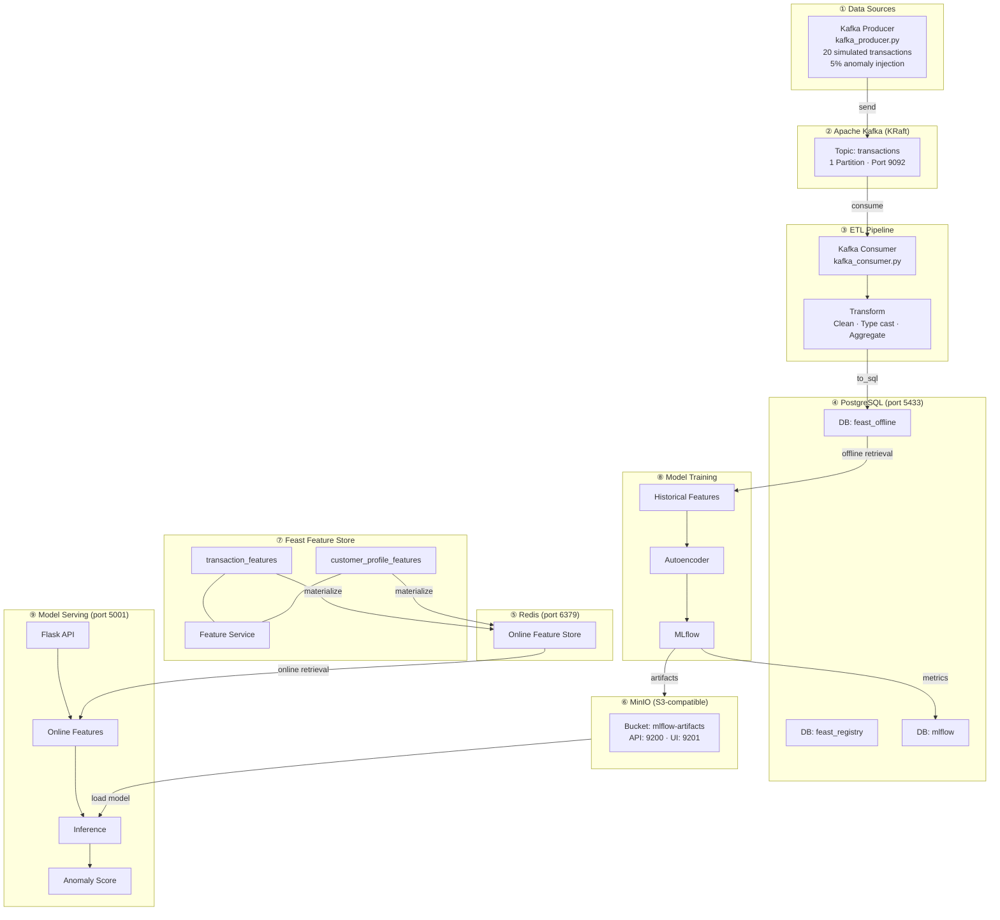

# MLOps Pipeline — Anomaly Detection

Credit card transaction anomaly detection using **Feast** (Feature Store) + **MLflow** (Experiment Tracking) + **PyTorch Autoencoder**, deployed on-premise with production-grade infrastructure.

## System Design



> Full diagram: [docs/system-design.mermaid](docs/system-design.mermaid)

---

## Infrastructure Components

### Docker Services

| Service | Image | Container | Port | Role |
|---------|-------|-----------|------|------|
| **Kafka** | `apache/kafka:3.9.0` | `mlops-kafka` | `9092` | Message broker (KRaft mode, no Zookeeper). Receives simulated transaction data from the producer and delivers it to the consumer ETL pipeline. |
| **PostgreSQL** | `postgres:16` | `mlops-postgres` | `5433` | Central database storing 3 isolated databases: `feast_registry` (feature metadata), `feast_offline` (historical feature tables), `mlflow` (experiment tracking metadata). |
| **Redis** | `redis:7-alpine` | `mlops-redis` | `6379` | Online feature store for Feast. Provides sub-millisecond feature retrieval during real-time model serving. Populated by `feast materialize`. |
| **MinIO** | `minio/minio:latest` | `mlops-minio` | `9200` (API) / `9201` (UI) | S3-compatible object storage. Stores MLflow artifacts: model weights (.pth), scaler.pkl, threshold.pkl. Replaces cloud S3 for on-premise deployment. |

### Feast Feature Store

| Component | Technology | Function |
|-----------|-----------|----------|
| **Registry** | PostgreSQL (`feast_registry` DB) | Stores feature metadata as protobuf blobs: entity definitions, feature views, data sources, feature services. Used by `feast apply` and `feast ui`. |
| **Offline Store** | PostgreSQL (`feast_offline` DB) | Two tables — `transactions` (per-transaction features) and `customer_profiles` (aggregated 30-day customer stats). Used for historical feature retrieval during training with point-in-time joins. |
| **Online Store** | Redis | Key-value store with latest feature values per `customer_id`. Updated by `feast materialize-incremental`. Used for real-time serving via `get_online_features()`. |
| **Entity** | `customer_id` (STRING) | Primary key for all feature lookups. Every feature row is associated with one customer. |
| **Feature View: `transaction_features`** | 6 features | `amount`, `merchant_category`, `transaction_hour`, `transaction_day_of_week`, `is_online`, `distance_from_home`. TTL: 30 days. |
| **Feature View: `customer_profile_features`** | 6 features | `avg_transaction_amount_30d`, `std_transaction_amount_30d`, `total_transactions_30d`, `avg_transactions_per_day_30d`, `max_transaction_amount_30d`, `unique_merchants_30d`. TTL: 90 days. |
| **Feature Service** | `training_service` / `serving_service` | Groups both feature views into a single API. Ensures training and serving use the same feature set (prevents training-serving skew). |

### MLflow

| Component | Technology | Function |
|-----------|-----------|----------|
| **Tracking Store** | PostgreSQL (`mlflow` DB) | Stores experiment metadata: run parameters, metrics (train_loss, AUC, precision, recall, F1), tags, and model registry (name, version, stage). |
| **Artifact Store** | MinIO (`mlflow-artifacts` bucket) | Stores binary artifacts: PyTorch model files, `scaler.pkl` (StandardScaler), `threshold.pkl` (anomaly threshold). Accessed via S3 protocol. |
| **Model Registry** | Within tracking store | Manages model lifecycle: `transaction-anomaly-detector` with versioning. Serving loads the latest version via `models:/transaction-anomaly-detector/latest`. |

### Model

| Property | Value |
|----------|-------|
| **Architecture** | Autoencoder: input → 32 → 16 → 8 → 16 → 32 → input |
| **Framework** | PyTorch |
| **Input** | 11 numerical features (scaled via StandardScaler) |
| **Training data** | Normal transactions only (label == 0) |
| **Anomaly detection** | Reconstruction error > threshold (95th percentile) → anomaly |
| **Serving** | Flask REST API with Feast online features + MLflow model |

---

## Ports Summary

| Port | Service | UI |
|------|---------|-----|
| `9092` | Kafka broker | — |
| `5433` | PostgreSQL | — |
| `6379` | Redis | — |
| `9200` | MinIO API | — |
| `9201` | MinIO Console | http://localhost:9201 |
| `5002` | MLflow UI | http://localhost:5002 |
| `5001` | Serving API | http://localhost:5001 |
| `8890` | Feast UI | http://localhost:8890 |

---

## Prerequisites

- **Python 3.11** (recommended, via conda)
- **Docker** + Docker Compose
- **Make**

---

## Step-by-step Guide

### Step 1: Create Python environment

```bash
conda create -n mlops python=3.11 -y
conda activate mlops
```

### Step 2: Install Python dependencies

```bash
make setup
```

Installs: Feast (postgres+redis), MLflow, kafka-python-ng, PyTorch, scikit-learn, boto3, Flask, etc.

### Step 3: Start all infrastructure services

```bash
make infra-up
```

This starts 4 Docker containers (Kafka, PostgreSQL, Redis, MinIO) + a one-shot init container that creates the `mlflow-artifacts` bucket in MinIO. Waits 15 seconds for all services to be healthy.

### Step 4: Register Feast features

```bash
make feast-apply
```

Scans `feature_repo/*.py`, registers entities, feature views, and feature services into the PostgreSQL registry. Creates necessary tables/keys in Redis for the online store.

### Step 5: Ingest data (Kafka → ETL → PostgreSQL)

```bash
make ingest
```

1. **Producer**: Generates 20 simulated credit card transactions (5% anomalies) and sends them to Kafka topic `transactions`.
2. **Consumer**: Reads all messages from Kafka, transforms them (type casting, timestamp creation), computes customer profile aggregations, and writes two tables (`transactions`, `customer_profiles`) to PostgreSQL offline store.

### Step 6: Materialize features (PostgreSQL → Redis)

```bash
make materialize
```

Pushes the latest feature values from PostgreSQL offline store to Redis online store. After this, `get_online_features()` will return data from Redis for real-time serving.

### Step 7: Train model

```bash
make train
```

1. Fetches historical features from Feast (point-in-time join on PostgreSQL).
2. Trains PyTorch autoencoder on normal transactions only.
3. Evaluates anomaly detection (AUC, precision, recall, F1).
4. Logs everything to MLflow: params, metrics, model weights → MinIO, scaler/threshold → MinIO.
5. Registers model as `transaction-anomaly-detector` in MLflow Model Registry.

### Step 8: Start serving API

```bash
make serve
```

Starts Flask API on port 5001. Loads the latest model from MLflow (MinIO), initializes Feast online store (Redis). Ready to score transactions.

### Step 9: Run end-to-end tests (separate terminal)

```bash
make test
```

Sends normal, anomalous, batch, and invalid requests to the serving API and validates responses.

### Step 10: Launch monitoring UIs

```bash
make ui
```

- **MLflow UI**: http://localhost:5002 — Browse experiments, compare runs, view model registry
- **Feast UI**: http://localhost:8890 — Browse entities, feature views, data sources
- **MinIO Console**: http://localhost:9201 — Browse artifact storage (user: `mlops_minio` / pass: `mlops_minio_secret`)

### Shortcut: Steps 3–7 in one command

```bash
make pipeline
```

---

## Test the API manually

```bash
# Normal transaction
curl -X POST http://localhost:5001/predict \
  -H "Content-Type: application/json" \
  -d '{"customer_id":"CUST_0001","amount":25.5,"transaction_hour":14,"transaction_day_of_week":2,"is_online":0,"distance_from_home":3.2}'

# Anomalous transaction
curl -X POST http://localhost:5001/predict \
  -H "Content-Type: application/json" \
  -d '{"customer_id":"CUST_0001","amount":9999.99,"transaction_hour":3,"transaction_day_of_week":1,"is_online":1,"distance_from_home":3000}'

# Batch prediction
curl -X POST http://localhost:5001/predict/batch \
  -H "Content-Type: application/json" \
  -d '{"transactions":[{"customer_id":"CUST_0010","amount":15,"transaction_hour":10,"transaction_day_of_week":3,"is_online":0,"distance_from_home":2},{"customer_id":"CUST_0020","amount":12000,"transaction_hour":3,"transaction_day_of_week":0,"is_online":1,"distance_from_home":4500}]}'

# Health check
curl http://localhost:5001/health
```

---

## Known Limitations & Weaknesses

### 1. Security: Hardcoded Credentials

| Issue | Location |
|-------|----------|
| PostgreSQL password `mlops_secret` | `docker-compose.yml`, `feature_store.yaml`, `train.py`, `serve.py`, `kafka_consumer.py` |
| MinIO credentials `mlops_minio` / `mlops_minio_secret` | `docker-compose.yml`, `train.py`, `serve.py`, `Makefile` |

**Risk**: Credentials are hardcoded directly in source code. If pushed to a public repo, the entire system is exposed.

**Recommendation**: Use `.env` files (gitignored), Docker secrets, or HashiCorp Vault. All credentials should be read from environment variables.

---

### 2. Data Pipeline: Not Idempotent & Poor Scalability

| Issue | Details |
|-------|----------|
| **`if_exists="replace"`** | `kafka_consumer.py` overwrites the entire `transactions` and `customer_profiles` tables on every run. Historical data is completely lost. |
| **No deduplication** | Kafka consumer uses `group_id=None` + `auto_offset_reset="earliest"`, re-reading all messages on every run → duplicate data if the producer runs multiple times. |
| **Only 20 transactions** | Producer defaults to 20 records with 5% anomaly ≈ 1 anomaly. Too few for the model to learn statistically meaningful patterns. |
| **No schema validation** | Consumer does not validate message schemas from Kafka. If the producer changes format, the pipeline fails uncontrollably. |
| **Batch-only ETL** | No streaming consumer (continuously running). Every time new data is needed, `make ingest` must be re-run manually. |

---

### 3. Feature Store: Potential Training-Serving Skew

| Issue | Details |
|-------|----------|
| **Customer profiles computed incorrectly** | `compute_customer_profiles()` computes aggregations over the entire current dataset, not an actual 30-day sliding window. The `*_30d` feature names are misleading. |
| **Manual materialization** | No job scheduler (cron, Airflow) to automate `materialize-incremental`. The online store can become stale. |
| **Feature freshness not monitored** | No way to know how stale features in Redis are. Serving may return results based on expired features. |

---

### 4. Model Training: Lacks Production Rigor

| Issue | Details |
|-------|----------|
| **No train/validation/test split** | All data is used for both training and evaluation. AUC, F1 are inflated and do not reflect generalization ability. |
| **Threshold = 95th percentile on entire data** | Threshold is computed on training data, creating data leakage. Should be computed on a separate validation set. |
| **No hyperparameter tuning** | Encoding dim, epochs, learning rate, batch size are all hardcoded. No grid search, random search, or Optuna. |
| **No early stopping** | Model always trains for the full 50 epochs. May overfit or waste compute. |
| **Fragile label join logic** | Labels are merged by `customer_id` (many-to-many). If a customer has both normal and anomaly transactions, labels are incorrectly assigned to some rows. |

---

### 5. Model Serving: Not Production-Ready

| Issue | Details |
|-------|----------|
| **Flask development server** | `app.run(debug=False)` still uses Flask's built-in server, single-threaded, which does not handle concurrent requests well. Production requires Gunicorn/uWSGI + Nginx. |
| **No authentication/authorization** | The `/predict` API is completely open; anyone can call it. Missing API key, JWT, or rate limiting. |
| **Incomplete input validation** | Only checks `customer_id` and `amount`. Does not validate `transaction_hour` (0-23), `transaction_day_of_week` (0-6), data types, or negative values. |
| **Scaler/threshold loaded from local files** | `serve.py` reads `scaler.pkl` and `threshold.pkl` from local `mlflow/artifacts/` instead of downloading from MLflow/MinIO. If deployed on a different server, the files won't exist. |
| **No model versioning logic** | Always loads the `latest` version. No canary deployment, A/B testing, or rollback mechanism. |
| **No graceful shutdown** | `pkill -f serve.py` in Makefile is brute-force. Does not guarantee in-flight requests are completed. |

---

### 6. Monitoring & Observability: Nearly Non-Existent

| Issue | Details |
|-------|----------|
| **No prediction logging** | Serving API does not log predictions. Cannot audit, debug False Positives/Negatives, or calculate model accuracy on production data. |
| **No data drift detection** | Does not monitor changes in input feature distributions over time. Model may degrade without anyone knowing. |
| **No model performance monitoring** | No feedback loop: when an anomaly is detected, there is no way to confirm whether it is correct or incorrect for retraining. |
| **No alerting** | If the serving API goes down, Kafka lags, or Redis becomes stale — no alerts are sent. |
| **No deep health checks** | `/health` only checks if the model is loaded. Does not verify connections to Redis, PostgreSQL, or model prediction quality. |

---

### 7. Infrastructure: Lacks Reliability

| Issue | Details |
|-------|----------|
| **`sleep 15` instead of health checks** | `make infra-up` uses a fixed `sleep 15` instead of polling health endpoints. On slower machines, services may not be ready yet. |
| **Single node, no replication** | Kafka 1 broker, PostgreSQL 1 instance, Redis 1 instance. Any single service failure = entire pipeline goes down. |
| **No backup strategy** | PostgreSQL data (Feast registry, offline store, MLflow metadata) has no backup schedule. If volumes are lost = everything is lost. |
| **No retention policy for Docker volumes** | Volumes grow indefinitely. No cleanup for old MLflow runs, stale features, or Kafka logs. |

---

### 8. Testing: Low Coverage

| Issue | Details |
|-------|----------|
| **Only E2E tests** | No unit tests for `autoencoder.py`, `kafka_consumer.py`, `train.py`. Bugs in transform/training logic are only discovered when running the full pipeline. |
| **E2E test does not assert anomaly detection accuracy** | `test_anomalous_transaction()` only checks response format, does not assert `is_anomaly == True`. Does not detect if the model is completely broken. |
| **No integration tests for Feast** | Does not test point-in-time join correctness, feature freshness, or online/offline consistency. |
| **Does not use pytest** | Test framework is hand-written with try/except. Lacks fixtures, parametrize, coverage reports, and CI integration. |

---

### 9. Reproducibility

| Issue | Details |
|-------|----------|
| **Random seed not set** | `kafka_producer.py` uses the `random` module without seeding. Each run generates different data → training results are not reproducible. |
| **Docker image tags not pinned** | `minio/minio:latest` and `minio/mc:latest` change over time. Today's build and tomorrow's build may differ. |
| **PyTorch seed not set** | `train.py` does not set `torch.manual_seed()`. Same data but different model weights on each training run. |

---

### Priority Summary

| Priority | Category | Reason |
|----------|----------|--------|
| **High** | Security (credentials), Train/test split, Flask production server | Directly affects security and model reliability |
| **Medium** | Idempotent pipeline, Monitoring, Input validation, Artifact loading | Causes failures when scaling or deploying to different environments |
| **Low** | Reproducibility, Backup, Testing framework | Important long-term but does not block MVP |

---

## Stop & Cleanup

```bash
# Stop all background services (UIs, serve, Docker)
make stop

# Full cleanup: remove data + Docker volumes
make clean
```
