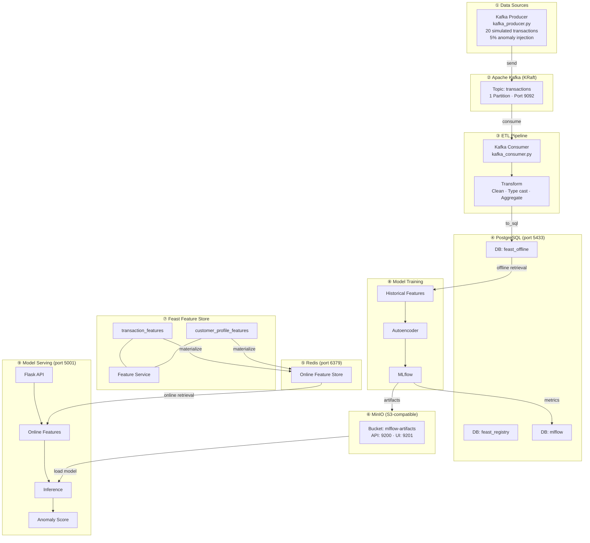

# MLOps Pipeline: Anomaly Detection

Credit card transaction anomaly detection using **Feast** (Feature Store) + **MLflow** (Experiment Tracking) + **PyTorch Autoencoder**, deployed on-premise with production-grade infrastructure.

## System Design



> Full diagram: [docs/system-design.mermaid](docs/system-design.mermaid)

---

## Infrastructure Components

### Docker Services

| Service | Image | Container | Port | Role |
|---------|-------|-----------|------|------|
| **Kafka** | `apache/kafka:3.9.0` | `mlops-kafka` | `9092` | Message broker (KRaft mode, no Zookeeper). Receives simulated transaction data from the producer and delivers it to the consumer ETL pipeline. |
| **PostgreSQL** | `postgres:16` | `mlops-postgres` | `5433` | Central database storing 3 isolated databases: `feast_registry` (feature metadata), `feast_offline` (historical feature tables), `mlflow` (experiment tracking metadata). |
| **Redis** | `redis:7-alpine` | `mlops-redis` | `6379` | Online feature store for Feast. Provides sub-millisecond feature retrieval during real-time model serving. Populated by `feast materialize`. |
| **MinIO** | `minio/minio:latest` | `mlops-minio` | `9200` (API) / `9201` (UI) | S3-compatible object storage. Stores MLflow artifacts: model weights (.pth), scaler.pkl, threshold.pkl. Replaces cloud S3 for on-premise deployment. |

### Feast Feature Store

| Component | Technology | Function |
|-----------|-----------|----------|
| **Registry** | PostgreSQL (`feast_registry` DB) | Stores feature metadata as protobuf blobs: entity definitions, feature views, data sources, feature services. Used by `feast apply` and `feast ui`. |
| **Offline Store** | PostgreSQL (`feast_offline` DB) | Two tables — `transactions` (per-transaction features) and `customer_profiles` (aggregated 30-day customer stats). Used for historical feature retrieval during training with point-in-time joins. |
| **Online Store** | Redis | Key-value store with latest feature values per `customer_id`. Updated by `feast materialize-incremental`. Used for real-time serving via `get_online_features()`. |
| **Entity** | `customer_id` (STRING) | Primary key for all feature lookups. Every feature row is associated with one customer. |
| **Feature View: `transaction_features`** | 6 features | `amount`, `merchant_category`, `transaction_hour`, `transaction_day_of_week`, `is_online`, `distance_from_home`. TTL: 30 days. |
| **Feature View: `customer_profile_features`** | 6 features | `avg_transaction_amount_30d`, `std_transaction_amount_30d`, `total_transactions_30d`, `avg_transactions_per_day_30d`, `max_transaction_amount_30d`, `unique_merchants_30d`. TTL: 90 days. |
| **Feature Service** | `training_service` / `serving_service` | Groups both feature views into a single API. Ensures training and serving use the same feature set (prevents training-serving skew). |

### MLflow

| Component | Technology | Function |
|-----------|-----------|----------|
| **Tracking Store** | PostgreSQL (`mlflow` DB) | Stores experiment metadata: run parameters, metrics (train_loss, AUC, precision, recall, F1), tags, and model registry (name, version, stage). |
| **Artifact Store** | MinIO (`mlflow-artifacts` bucket) | Stores binary artifacts: PyTorch model files, `scaler.pkl` (StandardScaler), `threshold.pkl` (anomaly threshold). Accessed via S3 protocol. |
| **Model Registry** | Within tracking store | Manages model lifecycle: `transaction-anomaly-detector` with versioning. Serving loads the latest version via `models:/transaction-anomaly-detector/latest`. |

### Model

| Property | Value |
|----------|-------|
| **Architecture** | Autoencoder: input → 32 → 16 → 8 → 16 → 32 → input |
| **Framework** | PyTorch |
| **Input** | 11 numerical features (scaled via StandardScaler) |
| **Training data** | Normal transactions only (label == 0) |
| **Anomaly detection** | Reconstruction error > threshold (95th percentile) → anomaly |
| **Serving** | Flask REST API with Feast online features + MLflow model |

---

## Ports Summary

| Port | Service | UI |
|------|---------|-----|
| `9092` | Kafka broker | — |
| `5433` | PostgreSQL | — |
| `6379` | Redis | — |
| `9200` | MinIO API | — |
| `9201` | MinIO Console | http://localhost:9201 |
| `5002` | MLflow UI | http://localhost:5002 |
| `5001` | Serving API | http://localhost:5001 |
| `8890` | Feast UI | http://localhost:8890 |

---

## Prerequisites

- **Python 3.11** (recommended, via conda)
- **Docker** + Docker Compose
- **Make**

---

## Step-by-step Guide

### Step 1: Create Python environment

```bash
conda create -n mlops python=3.11 -y
conda activate mlops
```

### Step 2: Install Python dependencies

```bash
make setup
```

Installs: Feast (postgres+redis), MLflow, kafka-python-ng, PyTorch, scikit-learn, boto3, Flask, etc.

### Step 3: Start all infrastructure services

```bash
make infra-up
```

This starts 4 Docker containers (Kafka, PostgreSQL, Redis, MinIO) + a one-shot init container that creates the `mlflow-artifacts` bucket in MinIO. Waits 15 seconds for all services to be healthy.

### Step 4: Register Feast features

```bash
make feast-apply
```

Scans `feature_repo/*.py`, registers entities, feature views, and feature services into the PostgreSQL registry. Creates necessary tables/keys in Redis for the online store.

### Step 5: Ingest data (Kafka → ETL → PostgreSQL)

```bash
make ingest
```

1. **Producer**: Generates 20 simulated credit card transactions (5% anomalies) and sends them to Kafka topic `transactions`.
2. **Consumer**: Reads all messages from Kafka, transforms them (type casting, timestamp creation), computes customer profile aggregations, and writes two tables (`transactions`, `customer_profiles`) to PostgreSQL offline store.

### Step 6: Materialize features (PostgreSQL → Redis)

```bash
make materialize
```

Pushes the latest feature values from PostgreSQL offline store to Redis online store. After this, `get_online_features()` will return data from Redis for real-time serving.

### Step 7: Train model

```bash
make train
```

1. Fetches historical features from Feast (point-in-time join on PostgreSQL).
2. Trains PyTorch autoencoder on normal transactions only.
3. Evaluates anomaly detection (AUC, precision, recall, F1).
4. Logs everything to MLflow: params, metrics, model weights → MinIO, scaler/threshold → MinIO.
5. Registers model as `transaction-anomaly-detector` in MLflow Model Registry.

### Step 8: Start serving API

```bash
make serve
```

Starts Flask API on port 5001. Loads the latest model from MLflow (MinIO), initializes Feast online store (Redis). Ready to score transactions.

### Step 9: Run end-to-end tests (separate terminal)

```bash
make test
```

Sends normal, anomalous, batch, and invalid requests to the serving API and validates responses.

### Step 10: Launch monitoring UIs

```bash
make ui
```

- **MLflow UI**: http://localhost:5002 — Browse experiments, compare runs, view model registry
- **Feast UI**: http://localhost:8890 — Browse entities, feature views, data sources
- **MinIO Console**: http://localhost:9201 — Browse artifact storage (user: `mlops_minio` / pass: `mlops_minio_secret`)

### Shortcut: Steps 3–7 in one command

```bash
make pipeline
```

---

## Test the API manually

```bash
# Normal transaction
curl -X POST http://localhost:5001/predict \
  -H "Content-Type: application/json" \
  -d '{"customer_id":"CUST_0001","amount":25.5,"transaction_hour":14,"transaction_day_of_week":2,"is_online":0,"distance_from_home":3.2}'

# Anomalous transaction
curl -X POST http://localhost:5001/predict \
  -H "Content-Type: application/json" \
  -d '{"customer_id":"CUST_0001","amount":9999.99,"transaction_hour":3,"transaction_day_of_week":1,"is_online":1,"distance_from_home":3000}'

# Batch prediction
curl -X POST http://localhost:5001/predict/batch \
  -H "Content-Type: application/json" \
  -d '{"transactions":[{"customer_id":"CUST_0010","amount":15,"transaction_hour":10,"transaction_day_of_week":3,"is_online":0,"distance_from_home":2},{"customer_id":"CUST_0020","amount":12000,"transaction_hour":3,"transaction_day_of_week":0,"is_online":1,"distance_from_home":4500}]}'

# Health check
curl http://localhost:5001/health
```

---

## Known Limitations & Weaknesses

> Phần này phân tích các điểm yếu hiện tại của flow, giúp người triển khai đánh giá rủi ro và lên kế hoạch cải thiện.

### 1. Security — Hardcoded Credentials

| Vấn đề | Vị trí |
|--------|--------|
| PostgreSQL password `mlops_secret` | `docker-compose.yml`, `feature_store.yaml`, `train.py`, `serve.py`, `kafka_consumer.py` |
| MinIO credentials `mlops_minio` / `mlops_minio_secret` | `docker-compose.yml`, `train.py`, `serve.py`, `Makefile` |

**Rủi ro**: Credentials nằm trực tiếp trong source code. Nếu push lên public repo, toàn bộ hệ thống bị lộ.

**Khuyến nghị**: Sử dụng `.env` file (gitignored), Docker secrets, hoặc HashiCorp Vault. Tất cả credentials nên được đọc từ environment variables.

---

### 2. Data Pipeline — Không có tính Idempotent & Scale kém

| Vấn đề | Chi tiết |
|--------|----------|
| **`if_exists="replace"`** | `kafka_consumer.py` ghi đè toàn bộ bảng `transactions` và `customer_profiles` mỗi lần chạy. Dữ liệu lịch sử bị mất hoàn toàn. |
| **Không có deduplication** | Kafka consumer dùng `group_id=None` + `auto_offset_reset="earliest"`, mỗi lần chạy đọc lại toàn bộ messages → dữ liệu trùng lặp nếu producer chạy nhiều lần. |
| **Chỉ 20 transactions** | Producer mặc định tạo 20 records với 5% anomaly ≈ 1 anomaly. Quá ít để model học được pattern có ý nghĩa thống kê. |
| **Không có schema validation** | Consumer không validate schema của messages từ Kafka. Nếu producer thay đổi format, pipeline fail không kiểm soát. |
| **Batch-only ETL** | Không có streaming consumer (chạy liên tục). Mỗi lần cần data mới phải chạy lại `make ingest` thủ công. |

---

### 3. Feature Store — Training-Serving Skew tiềm ẩn

| Vấn đề | Chi tiết |
|--------|----------|
| **Customer profiles tính sai** | `compute_customer_profiles()` tính aggregation trên toàn bộ dataset hiện tại, không phải sliding window 30 ngày thực sự. Tên feature `*_30d` gây hiểu lầm. |
| **Materialize thủ công** | Không có job scheduler (cron, Airflow) để tự động `materialize-incremental`. Online store có thể stale. |
| **Feature freshness không được monitor** | Không có cách biết features trong Redis đã cũ bao lâu. Serving có thể trả kết quả dựa trên features quá hạn. |

---

### 4. Model Training — Thiếu rigor cho Production

| Vấn đề | Chi tiết |
|--------|----------|
| **Không có train/validation/test split** | Toàn bộ data dùng cho cả training và evaluation. AUC, F1 bị inflated, không phản ánh khả năng generalize. |
| **Threshold = 95th percentile trên toàn bộ data** | Threshold được tính trên cả training data, tạo data leakage. Nên tính trên validation set riêng. |
| **Không có hyperparameter tuning** | Encoding dim, epochs, learning rate, batch size đều hardcoded. Không có grid search, random search, hay Optuna. |
| **Không có early stopping** | Model luôn train đủ 50 epochs. Có thể overfit hoặc lãng phí compute. |
| **Label join logic mong manh** | Labels merge bằng `customer_id` (many-to-many). Nếu 1 customer có cả normal và anomaly transactions, label bị gán sai cho một số rows. |

---

### 5. Model Serving — Chưa sẵn sàng Production

| Vấn đề | Chi tiết |
|--------|----------|
| **Flask development server** | `app.run(debug=False)` vẫn là Flask's built-in server, single-threaded, không handle concurrent requests tốt. Production cần Gunicorn/uWSGI + Nginx. |
| **Không có authentication/authorization** | API `/predict` mở hoàn toàn, ai cũng có thể gọi. Thiếu API key, JWT, hoặc rate limiting. |
| **Không có input validation đầy đủ** | Chỉ check `customer_id` và `amount`. Không validate `transaction_hour` (0-23), `transaction_day_of_week` (0-6), kiểu dữ liệu, hoặc giá trị âm. |
| **Scaler/threshold load từ local file** | `serve.py` đọc `scaler.pkl` và `threshold.pkl` từ `mlflow/artifacts/` local thay vì download từ MLflow/MinIO. Nếu deploy trên server khác, file không tồn tại. |
| **Không có model versioning logic** | Luôn load `latest` version. Không có canary deployment, A/B testing, hay rollback mechanism. |
| **Không có graceful shutdown** | `pkill -f serve.py` trong Makefile là brute-force. Không đảm bảo in-flight requests được xử lý xong. |

---

### 6. Monitoring & Observability — Gần như không có

| Vấn đề | Chi tiết |
|--------|----------|
| **Không có prediction logging** | Serving API không log predictions. Không thể audit, debug False Positive/Negative, hay tính model accuracy trên production data. |
| **Không có data drift detection** | Không monitor sự thay đổi phân phối của input features theo thời gian. Model có thể degraded mà không ai biết. |
| **Không có model performance monitoring** | Không có feedback loop: khi anomaly bị phát hiện, không có cách xác nhận nó đúng hay sai để retrain. |
| **Không có alerting** | Nếu serving API down, Kafka lag, hoặc Redis stale — không có alert nào được gửi. |
| **Không có health check sâu** | `/health` chỉ check model loaded. Không verify kết nối tới Redis, PostgreSQL, hay model prediction quality. |

---

### 7. Infrastructure — Thiếu Reliability

| Vấn đề | Chi tiết |
|--------|----------|
| **`sleep 15` thay cho health check** | `make infra-up` dùng `sleep 15` cố định thay vì polling health endpoints. Trên máy chậm, services có thể chưa ready. |
| **Single node, no replication** | Kafka 1 broker, PostgreSQL 1 instance, Redis 1 instance. Bất kỳ service nào fail = toàn bộ pipeline down. |
| **Không có backup strategy** | PostgreSQL data (Feast registry, offline store, MLflow metadata) không có backup schedule. Volume mất = mất toàn bộ. |
| **Docker volumes không có retention policy** | Volumes grow vô hạn. Không có cleanup cho old MLflow runs, stale features, hay Kafka logs. |

---

### 8. Testing — Coverage thấp

| Vấn đề | Chi tiết |
|--------|----------|
| **Chỉ có E2E test** | Không có unit tests cho `autoencoder.py`, `kafka_consumer.py`, `train.py`. Bug trong transform/training logic chỉ phát hiện khi chạy full pipeline. |
| **E2E test không assert anomaly detection chính xác** | `test_anomalous_transaction()` chỉ check response format, không assert `is_anomaly == True`. Không phát hiện nếu model completely broken. |
| **Không có integration test cho Feast** | Không test point-in-time join correctness, feature freshness, hay online/offline consistency. |
| **Không dùng pytest** | Test framework tự viết bằng try/except. Thiếu fixtures, parametrize, coverage report, CI integration. |

---

### 9. Reproducibility

| Vấn đề | Chi tiết |
|--------|----------|
| **Random seed không được set** | `kafka_producer.py` dùng `random` module không seed. Mỗi lần chạy tạo data khác nhau → kết quả training không reproducible. |
| **Không pin Docker image tags** | `minio/minio:latest` và `minio/mc:latest` thay đổi theo thời gian. Build hôm nay và build ngày mai có thể khác nhau. |
| **PyTorch không set seed** | `train.py` không set `torch.manual_seed()`. Cùng data nhưng model weights khác nhau mỗi lần train. |

---

### Tóm tắt mức độ ưu tiên

| Ưu tiên | Hạng mục | Lý do |
|---------|----------|-------|
| 🔴 **Cao** | Security (credentials), Train/test split, Flask production server | Ảnh hưởng trực tiếp đến bảo mật và độ tin cậy của model |
| 🟡 **Trung bình** | Idempotent pipeline, Monitoring, Input validation, Artifact loading | Gây lỗi khi scale hoặc deploy trên môi trường khác |
| 🟢 **Thấp** | Reproducibility, Backup, Testing framework | Quan trọng dài hạn nhưng không block MVP |

---

## Stop & Cleanup

```bash
# Stop all background services (UIs, serve, Docker)
make stop

# Full cleanup: remove data + Docker volumes
make clean
```
